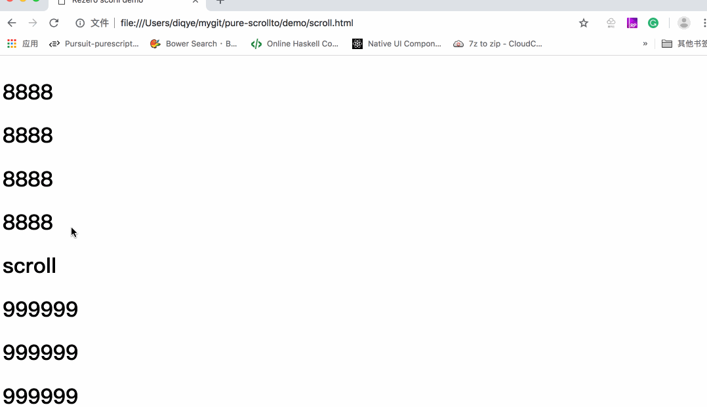

# pure-scrollto
Scroll to the specified element

## install && import

```bash
npm i pure-scrollto --save
```

```javascript
import scrollTo from 'pure-scrollto'
```
or

```javascript
let scrollTo = from 'pure-scrollto'
```

## usage

```
let element  = document.querySelect('#xx')
scrollTo(element)
```

## features


